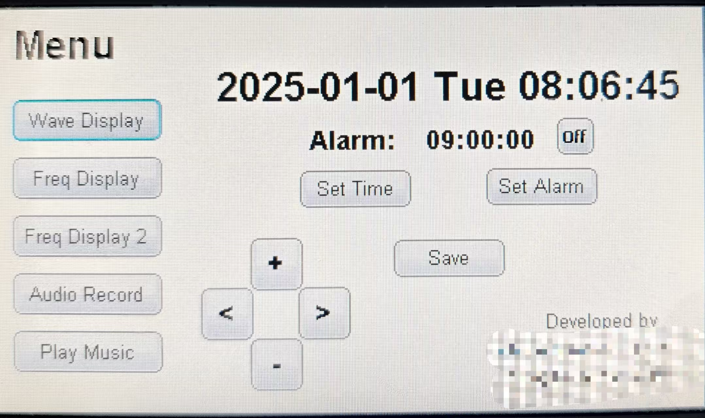
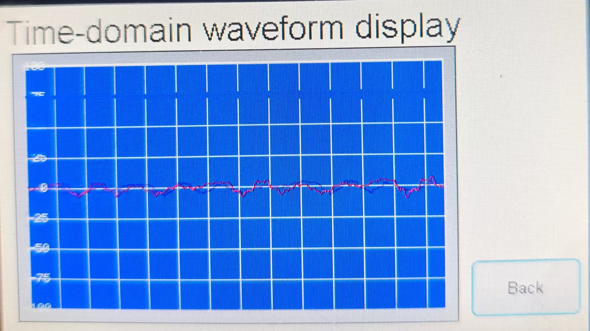
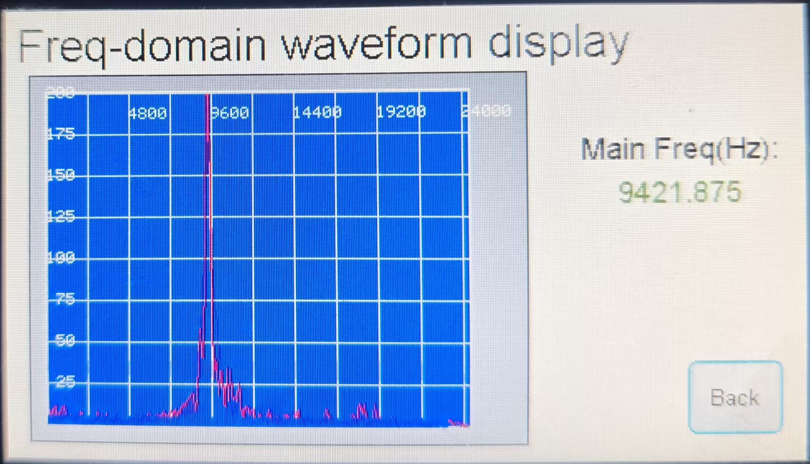
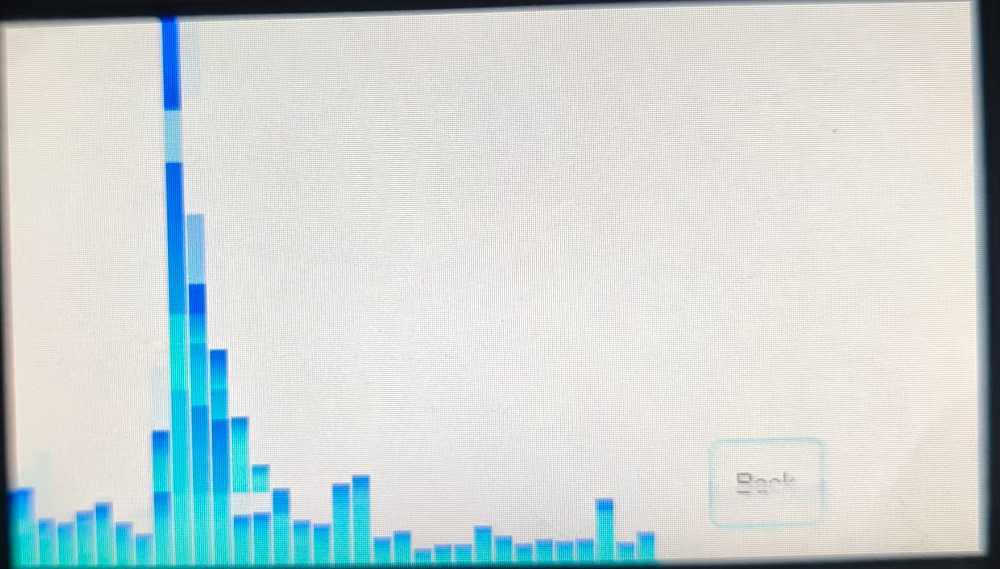
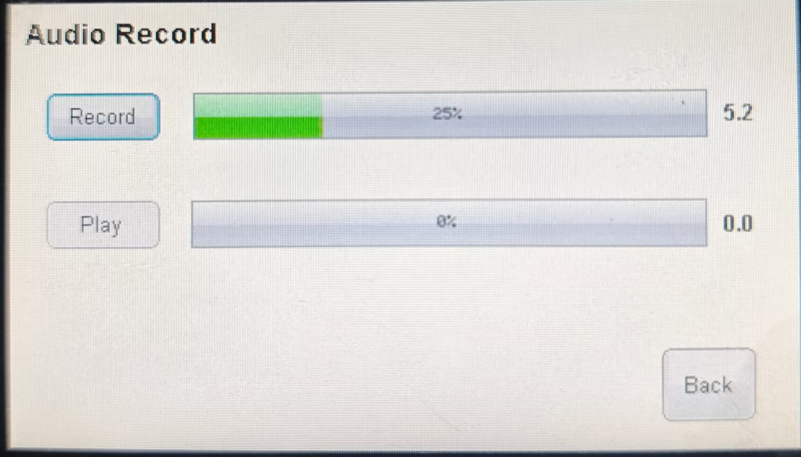

## 一、功能说明

- 1、时域波形实时显示（范围0—8khz）
- 2、音频功率谱实时显示（范围0——24khz，分辨率 <100hz）
- 3、音频功率谱多样化显示
- 4、主音调提取和回放功能（范围0——4khz，分辨率 <4hz）
- 5、读取MIDI文件并播放

## 二、设计参数

- RTC时钟源为32Mhz低速内部时钟
- 波形显示：16khz采样率，512点快速傅里叶变换（FFT），频率分辨率 16000 / 512 = 31.25
- 功率谱波形显示：48khz采样率，512点快速傅里叶变换（FFT），频率分辨率 48000 / 512 = 93.75
- 主音调提取和回放：8khz采样率，2048点快速傅里叶变换（FFT），频率分辨率 8000 、 2048 ≈ 3.9，录音时间20s，共 20 * 8000 / 2048 ≈ 78 帧，每帧采样时长 2048 = 256ms

## 三、开发环境

- 代码生成工具:STM32CubeMX 5.4.0
- 编译调试工具:IAR
- GUI库: emWin图形库

## 四、硬件信息

- 芯片型号：STM32F746NG
- 开发板电路图（见上方文件）
- 扩展版引脚图

    

## 五、注意事项
- 1、如果要运行，直接双击打开 `.\EWARM\Project.eww`

- 2、如果要通过Cubemx修改其他配置，**请先备份!!**，然后再进行修改。在点击“Generate Code”后先别打开工程，要把备份中的`.Inc\GUI_App.h`和`.Src\GUI.App.c`复制到当前工程中，然后再通过上面第1点的方式打开工程。

- 3、如果IAR出现无法打开iar_cortexM7ls_math.a的问题，应该先移除`iar_cortexM7ls_math.a`,然后再手动添加一遍

## 六、效果预览

- 1、菜单页面与时间显示
    
- 2、波形显示页面
    
- 3、频域波形显示（256段）
    
- 4、频域波形显示（32段）
    
- 5、音调提取与播放
    