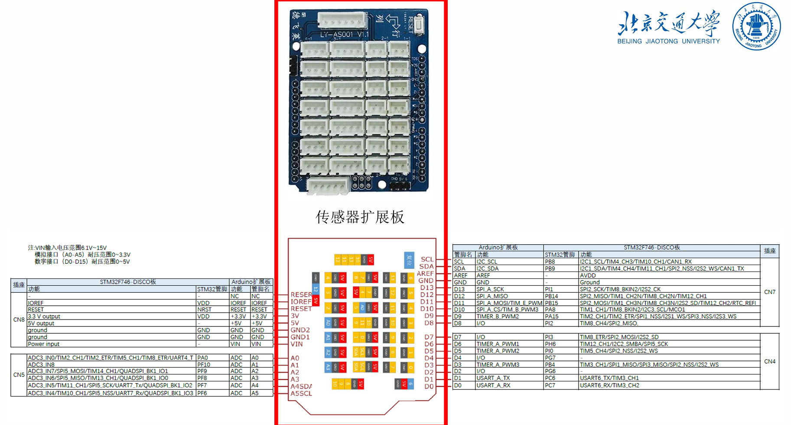

## 一、功能说明

- 1、时域波形实时显示（范围0—8khz）
- 2、音频功率谱实时显示（范围0——24khz，分辨率 <100hz）
- 3、音频功率谱多样化显示
- 4、主音调提取和回放功能（范围0——4khz，分辨率 <4hz）
- 5、读取MIDI文件并播放

## 二、设计参数

- 波形显示：16khz采样率，512点快速傅里叶变换（FFT），频率分辨率 16000 / 512 = 31.25
- 功率谱波形显示：48khz采样率，512点快速傅里叶变换（FFT），频率分辨率 48000 / 512 = 93.75
- 主音调提取和回放：8khz采样率，2048点快速傅里叶变换（FFT），频率分辨率 8000 、 2048 ≈ 3.9，录音时间20s，共 20 * 8000 / 2048 ≈ 78 帧，每帧采样时长 2048 = 256ms

## 三、开发环境

- STM32CubeMX 5.4.0
- IAR

## 四、硬件信息

- 芯片型号：STM32F746NG
- 开发板电路图（见上方文件）
- 扩展版引脚图

    

